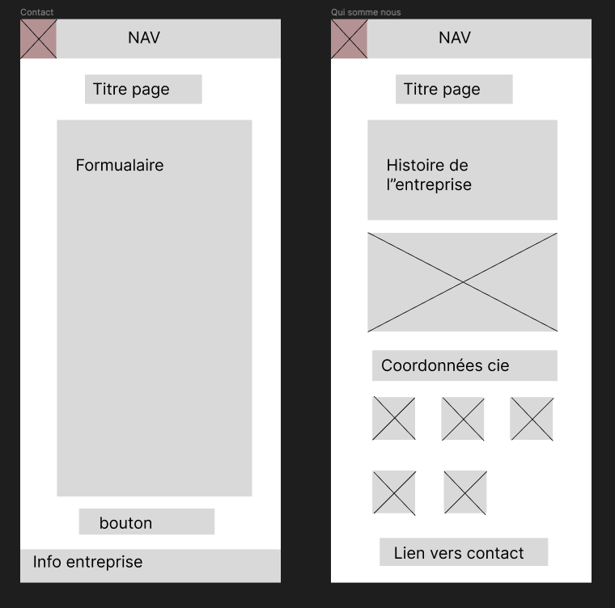

# Exo1_CSS

## Charte graphique

# Logo

Couleurs Listez les couleurs utilisées ci-après en donnant les valeurs en hexadécimal.
#0D1821
#6AD5CB
#EF767A

# Icônes Listez toutes vos icônes ici.

# Polices Listez toutes vos polices ici (avec le lien direct depuis Google Font).

MONTSERRAT

<link rel="preconnect" href="https://fonts.googleapis.com"><link rel="preconnect" href="https://fonts.gstatic.com" crossorigin><link href="https://fonts.googleapis.com/css2?family=Montserrat:ital,wght@0,200;0,300;0,600;0,900;1,200;1,300;1,600;1,900&display=swap" rel="stylesheet">

ABORETO
<link rel="preconnect" href="https://fonts.googleapis.com"><link rel="preconnect" href="https://fonts.gstatic.com" crossorigin><link href="https://fonts.googleapis.com/css2?family=Aboreto&display=swap" rel="stylesheet">

Spécifiez à quels éléments doivent être appliqué chaque police.

Aboreto regular XXpx pour le titre de niveau h1

Montserrat light XXpx pour le titre de niveau h2

Montserrat regular pour le body

# Maquettes Affichez toutes vos maquettes ici au format images (png ou jpeg).

